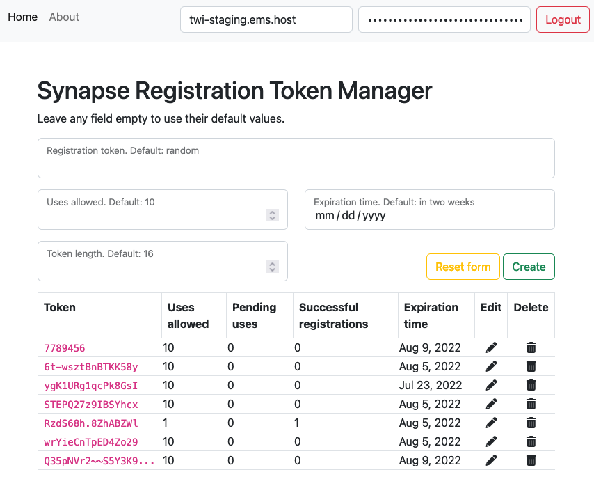

# Synapse Registration Token Manager

Simple web app for managing Synapse registration tokens. This app does not require any particular server backend. Just serve the `src` directory. All magic happens in the user's browser.

